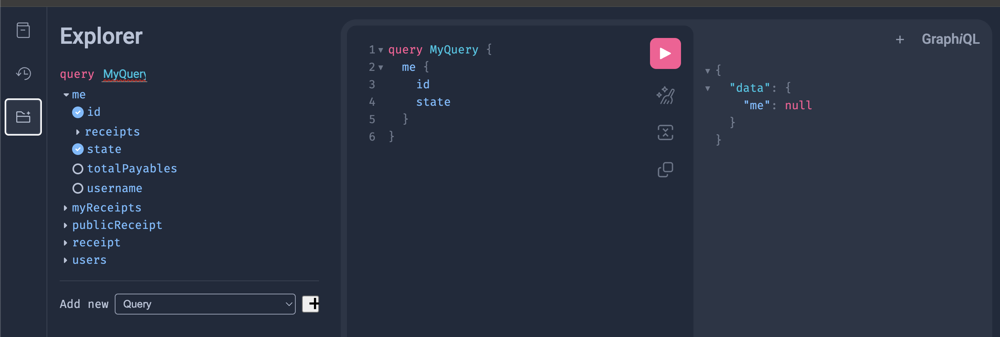

# Ezsplit UI

Frontend of [EZsplit](https://github.com/carlqt/ezsplit)

## Getting Started

### Introduction

The project is written primary using `react` and uses [tanstack router](https://tanstack.com/router/latest/docs/framework/react/overview) as the router. Tanstack router is a file based router that automatically generates the routes.

For the API, the project uses `graphql` and you can reach it using the path `/api/query` if `Caddy` is running.

The repo uses `git submodules` to pull in the backend as part of development.

For most cases, the only backend dependency you'll need to worry about is `docker`.

The repo uses `caddy` as a reverse proxy to avoid the common CORS problem.

`pnpm` is the package manager for this project. You can check https://pnpm.io/installation on how to install/use it.

Lastly, it's recommended to use [asdf](https://asdf-vm.com/guide/getting-started.html) or any node version manager that can read `.tool-versions` file to keep the environment in sync.

### Requirements to run the app:
- [Docker](https://docs.docker.com/engine/install/)
- [pnpm](https://pnpm.io/installation)
- Running backend

### Running the app

To get things started, make sure you have the latest changes from the backend by fetching it using the submodule:
```sh
git submodule update --remote --merge

# OR use the script alias found in package.json
pnpm submodule:update
```
If there are new commits, it will show up when you run `git status`. Most of the time, we want to commit these new updates so the project is updated.

Once we're sure we're using the latest changes from the backend, we need to run it using the command:
```sh
docker compose up --build

# You can also drop the --build flag if there are no new changes
docker compose up
``` 

After the server is running, we need to apply the schema changes to the DB and seed it with some data:
```
pnpm db:setup
```
If the command is successful, you'll be able to use the following credentials to login:
- username - john_smith
- password - password

Install the packages by running:
```sh
pnpm install
```

Then start the frontend by running `pnpm dev` and access it in the browser on http://localhost:3000

**Note:**
`localhost:5173` is not used to avoid CORS.


## Understanding the codebase

### Pages and Routes
The project uses `tanstack router` to generate the routes. You might want to read a bit how it works but basically, as soon as you create a file/folder under the `routes` directory, it will immediately create a route for that file.

The project follows a `self-contained` folder structure where all the depenencies of a component should be contained within itself.

An example of this is when viewing the folders under `src/routes`. Each folder represents a page of the app, viewable from the browser. Each components that this page have should within the respective directory unless the component is shared.

Note that it doesn't have to be limited to components, it also applies to hooks, mutations, helpers or anything that the page needs.

### Graphql and code generation

The source of truth of the graphql schema is found in the backend and can be found under `ezsplit/graph/*.graphqls` (The directory should be available in this project as soon as you pulled the submodules)


To sync the schema to the frontend, run the command `pnpm codegen`. This command uses `Codegen` to generate type safe codes under [__generated__](src/__generated__/) folder.

## Testing

To help with understanding graphql, you can use the interactive playground bundled in the backend. You can access it on http://localhost:7777/api/playground. Use the `explorer` to easily visualize the project schema.


